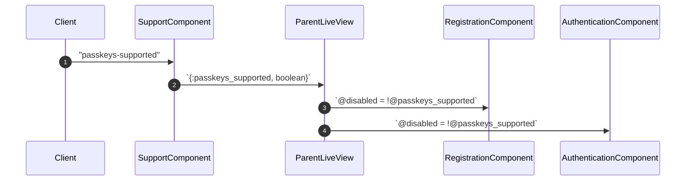
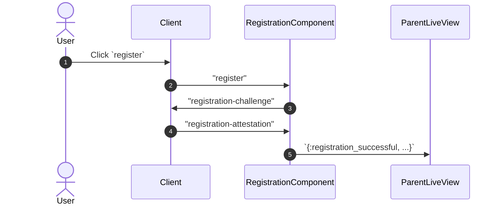
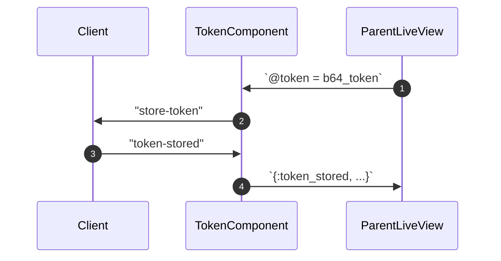
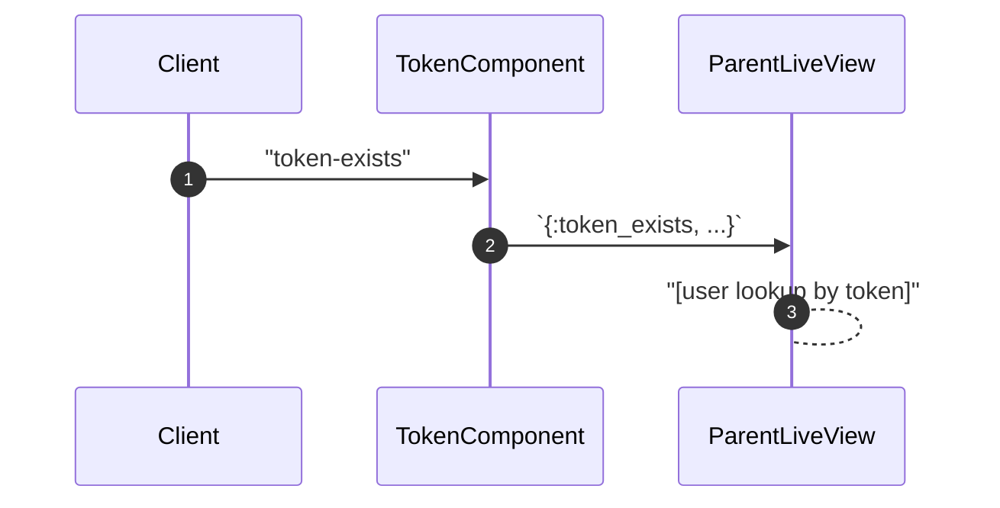
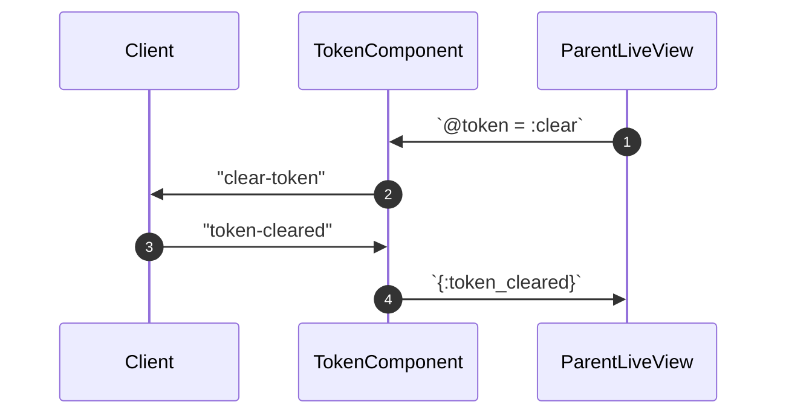
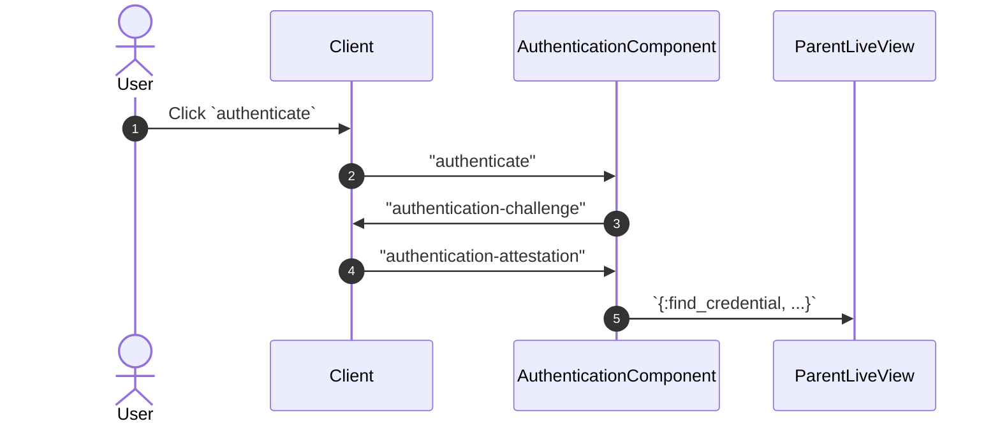

# WebauthnComponents

A collection of drop-in LiveComponents for password-less authentication.

### Status: Beta 💅🏻

Please **do not use WebauthnComponents in a production environment** until it has completed _beta_ testing.

This package is a **work in progress**, and it is in early beta status.

Feel free to experiment with this package and contribute feedback through [GitHub discussions](https://github.com/liveshowy/webauthn_components/discussions) or the related topic in [Elixir Forum](https://elixirforum.com/t/webauthnlivecomponent-passwordless-auth-for-liveview-apps/49941).

## Roadmap

View the planned work for this repo in the public [WebauthnComponents v1](https://github.com/orgs/liveshowy/projects/3/views/1) project on GitHub.

## Quick Start

During the beta phase, generators will be added to streamline initial setup, including running migrations, generating related modules, etc. Steps marked `(TODO)` need additional documentation, and some may be streamlined by Mix tasks during the beta phase.

1. Add Mix dependency
1. Add `WebAuthn` hook to `app.js`
1. Run Mix task to create `user_keys` schema & migration
   - `mix phx.gen.context --binary-id Authentication UserKey user_keys key_id:binary label last_used:utc_datetime public_key:binary user_id:references:users`
1. Update `UserKey` schema (TODO)
   - Add default value to the `label` field
   - Update the `public_key` field to use `WebauthnComponents.CoseKey` as its type
   - Add `new_changeset/2` & `update_changeset/2` (TODO)
1. Run Mix task to create `user_tokens` schema & migration
   - `mix phx.gen.context --binary-id Authentication UserToken user_tokens user_id:references:users token:binary context`
1. Update `UserToken` schema
   - Update the `context` field to use `Ecto.Enum` as its type with `values: [:session, :device_code]` and `default: :session`
   - Replace `user_id` field with `belongs_to` `User` association
   - Add `foreign_key_constraint` `:user_id`
   - Add token helper functions (TODO)
1. Update `User` and/or relevant schemas to include keys association (TODO)

### Installation

Add `webauthn_components` to your list of dependencies in `mix.exs`:

```elixir
def deps do
  [
    {:webauthn_components, "~> 0.3"}
  ]
end
```

## Usage

See [USAGE.md](./USAGE.md) for detailed usage instructions.

### WebAuthn Flows

`WebauthnComponents` contains a few modular components which may be combined to detect passkey support, register new keys, authenticate keys for existing users, and manage session tokens in the client.

See module documentation for each component for more detailed descriptions.

## Cross-Device Authentication

When a user attempts to authenticate on a device where their Passkey is **not** stored, they may scan a QR code to use a cloud-sync'd Passkey.

### Example

Imagine a user, Amal, registers a Passkey for example.com on their iPhone and it's stored in iCloud. When they attempt to sign into example.com on a non-Apple device or any browser which cannot access their OS keychain, they may choose to scan a QR code using their iPhone. Assuming the prompts on the iPhone are successful, the other device will be authenticated using the same web account which was initially registered on the iPhone.

While this example refers to Apple's Passkey implementation, the process on other platforms may vary. Cross-device credential managers like 1Password may provide a more seamless flow for users who are not constrained to one OS or browser.

#### Support Detection



#### Registration

**Sign Up**



Once the parent LiveView receives the `{:registration_successful, ...}` message, it must persist the user, the user's new key. To keep the user signed in, the LiveView may [create a session token](#token-management), Base64-encode the token, and pass it to `TokenComponent` for persistence in the client's `sessionStorage`.

#### Token Management

**Successful Sign Up / Sign In**



**Active Session**



**Sign Out**



#### Authentication

**Sign In**



Once the parent LiveView receives the `{:find_credential, ...}` message, it must lookup the user via the user's existing key. To keep the user signed in, the LiveView may [create a session token](#token-management), Base64-encode the token, and pass it to `TokenComponent` for persistence in the client's `sessionStorage`.

## WebAuthn & Passkeys

> The Web Authentication API is an extension of the Credential Management API that enables strong authentication with public key cryptography, enabling passwordless authentication and/or secure second-factor authentication without SMS texts.
>
> https://developer.mozilla.org/en-US/docs/Web/API/Web_Authentication_API

> A passkey is a FIDO login credential, tied to an origin (website or application) and a physical device. Passkeys allow users to authenticate without having to enter a username, password, or provide any additional authentication factor. This technology aims to replace passwords as the primary authentication mechanism.
>
> https://developers.google.com/identity/fido

Passkeys are essentially a standard to sync WebAuthn credentials with cloud platforms like [iCloud Keychain](https://developer.apple.com/passkeys/), [Android](https://developers.google.com/identity/fido), [1Password](https://blog.1password.com/1password-is-joining-the-fido-alliance/), with more to come.

### Benefits

There are many benefits to users and application maintainers when passwords are decommissioned.

- Eliminates password reuse by users.
- Mitigates credential stuffing attacks by hackers.
- Eliminates phishing attacks by hackers.

For users on a device with Passkey support, WebAuthn credentials may be stored in the cloud. This allows the user to authenticate from other cloud-connected devices without registering each device individually.

### Known Issues

While WebAuthn provides an API for improved authentication security, there are a few limitations to consider before adopting this component.

- As of 2022, Passkeys are not universally supported.
- If a user registers or authenticates on a device without Passkey support, the generated key pair will not be synced, and each device must be registered in order to access an account.
- Cloud-synced credentials are only accessible to devices authenticated to the cloud account.
  - For example, a credential saved to iCloud Keychain will not be synced automatically to Android's credential manager.

## Browser Support

The WebAuthn API has broad support across the most common modern browsers.

https://caniuse.com/?search=webauthn

## Additional Resources

- https://webauthn.guide/
- https://developer.mozilla.org/en-US/docs/Web/API/Web_Authentication_API
- https://fidoalliance.org/fido2-2/fido2-web-authentication-webauthn/
- https://www.w3.org/TR/webauthn-2/
