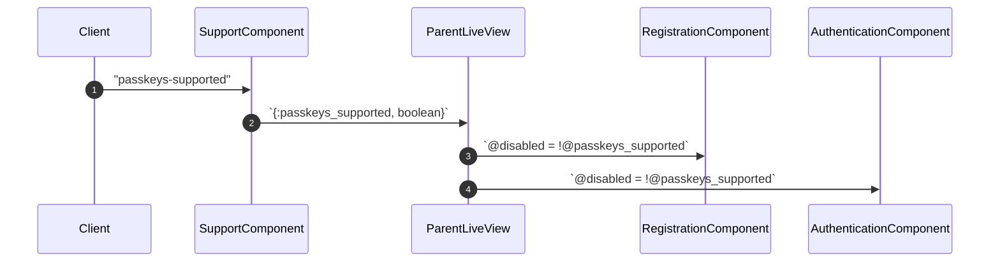
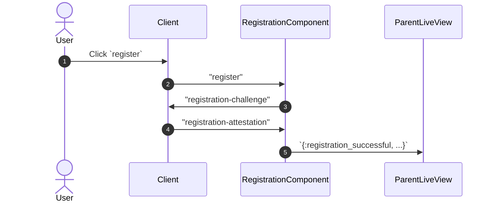
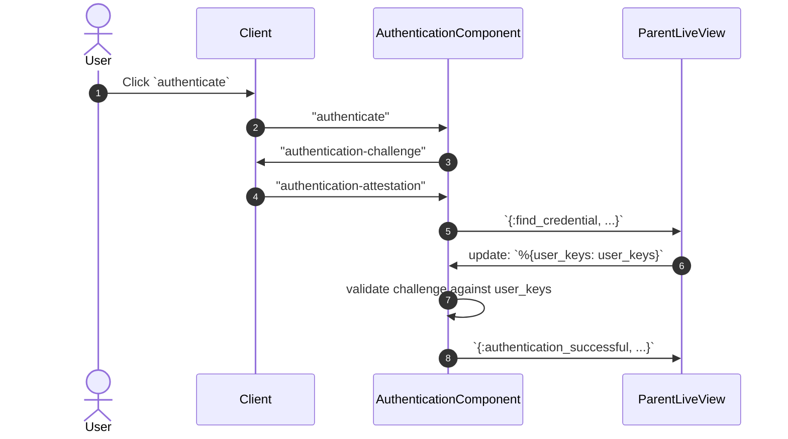
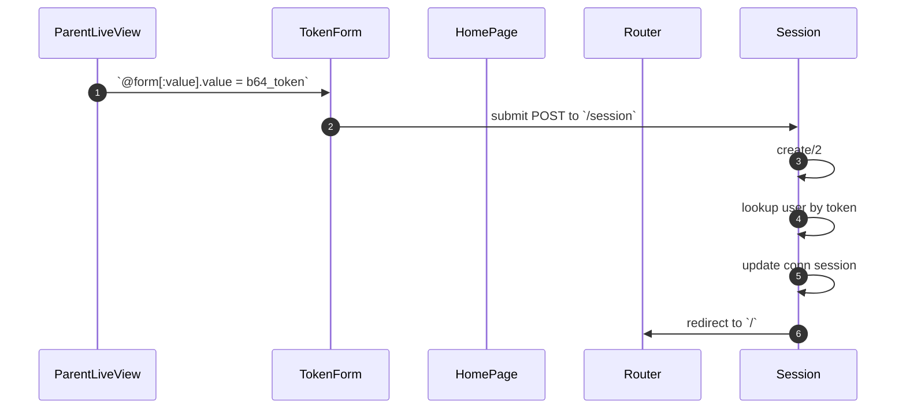
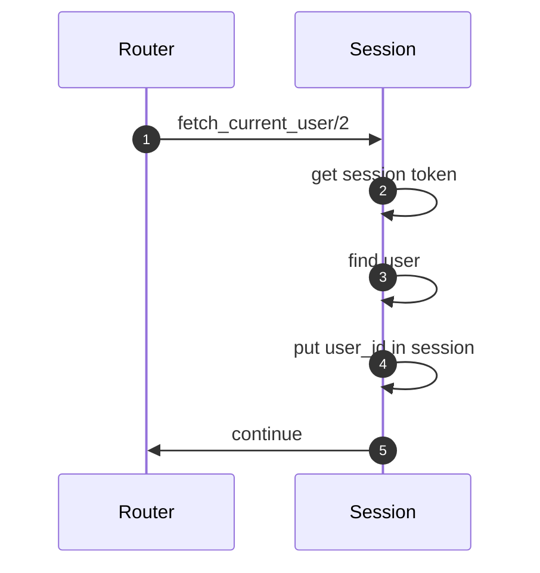
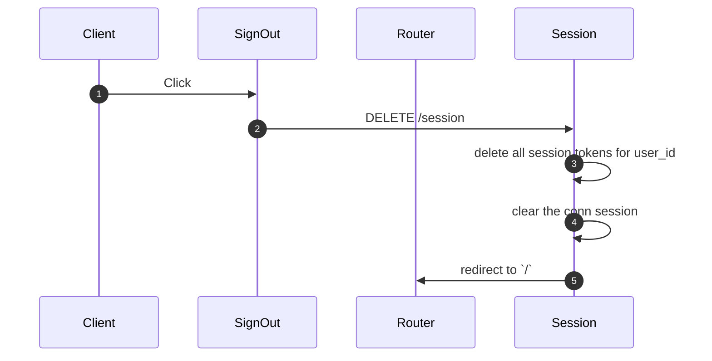

# WebAuthn Flows

- [WebAuthn Flows](#webauthn-flows)
  - [Support Detection](#support-detection)
  - [Registration](#registration)
  - [Authentication](#authentication)
  - [Token Management](#token-management)

`WebauthnComponents` contains a few modular components which may be combined to detect passkey support, register new keys, authenticate keys for existing users, and manage session tokens in the client.

See module documentation for each component for more detailed descriptions.

> 🧯 The following charts focus on the success path, where no error has ocurred.

## Support Detection

## Registration

A user wants to create a **new** account. If the user is already authenticated when they navigate to `/sign-in`, the LiveView will redirect to `/`.

Once the parent LiveView receives the `{:registration_successful, ...}` message, it must persist the `%User{}` and `%UserKey{}`. The `wac.install` generator casts the new user key as an association in the user params, so both are created at once.

To keep the user signed in, the LiveView may [create a session token](#token-management).

## Authentication

A user wants to sign into an **existing** account. If the user is already authenticated when they navigate to `/sign-in`, the LiveView will redirect to `/`.

Once the parent LiveView receives the `{:find_credential, ...}` message, it must lookup the user via the user's existing key. To keep the user signed in, the LiveView may [create a session token](#token-management), Base64-encode the token, and pass it to `TokenComponent` for persistence in the client's `sessionStorage`.

## Token Management

A user has successfully registered or authenticated.

The LiveView will render a separate hidden form on the page, with a text input for the `%UserToken{}` value. When this form is rendered, it will trigger a JS click on its own submit button, which will result in a `POST` to `/session`, protected by Phoenix's default CSRF protections ([Plug docs](https://hexdocs.pm/plug/Plug.CSRFProtection.html)).

The `Session` controller then validates the token before updating the connection session and redirecting to `/` upon success. If the token is invalid, the user will be redirected to `/sign-in` with a flash message to sign in.

**Successful Registration or Authentication**

A user has successfully registered or authenticated.

**Active Session**

A user already has a valid session token.

**Sign Out**

A user has clicked the "Sign Out" button.

