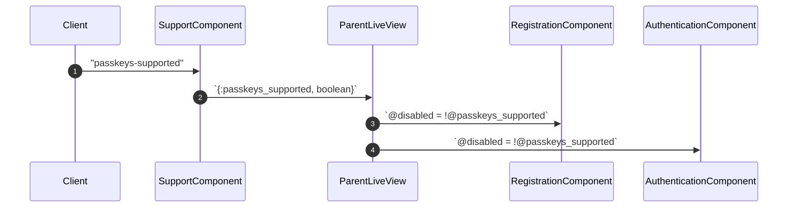
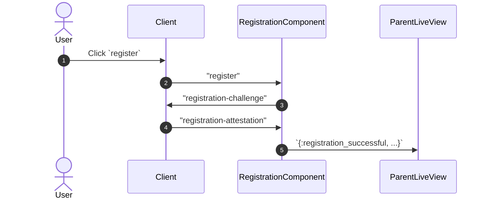
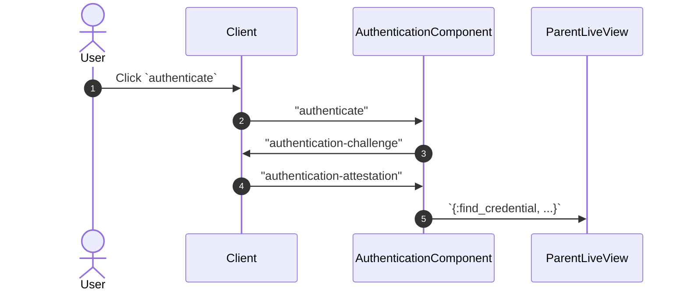
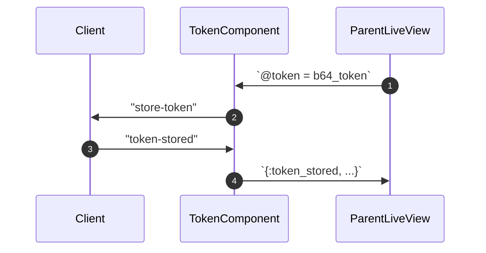
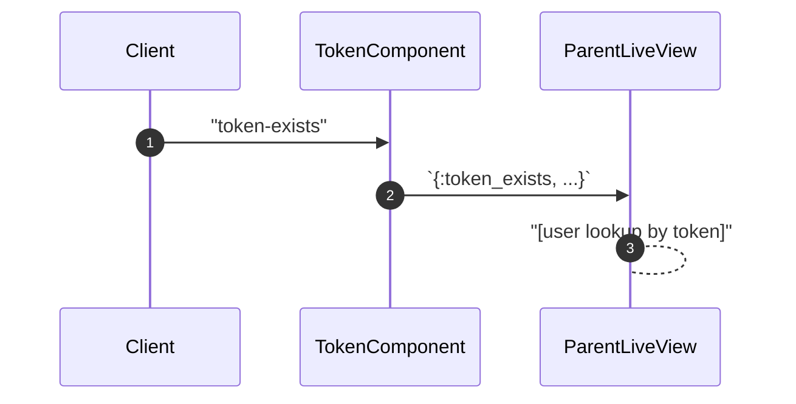
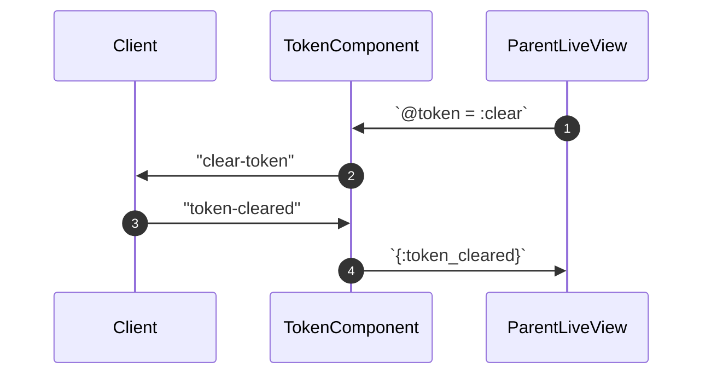

# WebAuthn Flows

`WebauthnComponents` contains a few modular components which may be combined to detect passkey support, register new keys, authenticate keys for existing users, and manage session tokens in the client.

See module documentation for each component for more detailed descriptions.

### Support Detection

### Registration

A user wants to create a **new** account. If the user is already authenticated when they navigate to `/sign-in`, the LiveView will redirect to `/`.

Once the parent LiveView receives the `{:registration_successful, ...}` message, it must persist the `%User{}` and `%UserKey{}`. The `wac.install` generator casts the new user key as an association in the user params, so both are created at once.

To keep the user signed in, the LiveView may [create a session token](#token-management).

### Authentication

A user wants to sign into an **existing** account. If the user is already authenticated when they navigate to `/sign-in`, the LiveView will redirect to `/`.

Once the parent LiveView receives the `{:find_credential, ...}` message, it must lookup the user via the user's existing key. To keep the user signed in, the LiveView may [create a session token](#token-management), Base64-encode the token, and pass it to `TokenComponent` for persistence in the client's `sessionStorage`.

### Token Management

A user has successfully registered or authenticated.

**Active Session**

**Sign Out**

